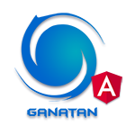

# Angular 22.0.3 Started


<table>
<tr>
<td>
  <a href="https://www.ganatan.com/en">
    
  </a>

it's part of a repo series designed

to create a **Web Application with Angular 22**

* Featuring [**Angular 22.0.2**](https://github.com/angular/angular/releases) & [**Angular CLI 22.0.3**](https://github.com/angular/angular-cli/releases/)


* See the [**Angular Live demo**](#angular-live-demo), Test the repo with [**Quick start**](#angular-quick-start) and for more information Read the step by step [**Tutorial**](#angular-tutorial) or read the [**Getting started**](#angular-getting-started)

---


</td>
</tr>
</table>

# [Angular Quick start](#angular-quick-start)

```bash
# download the example or clone the repo from github
git clone https://github.com/ganatan/angular-node-java.git

# change directory
cd frontend-angular

# install the repo with npm
npm install

# start the server
npm start

```
in your browser go to [http://localhost:4200](http://localhost:4200) 


# [Angular Getting started](#angular-getting-started)


## Installation
* `npm install` (installing dependencies)
* `npm outdated` (verifying dependencies)

## Development
* `npm run start`
* in your browser go to [http://localhost:4200](http://localhost:4200) 

## Production 
* `npm run build`

## Linter
* `npm run lint`

## Tests
* `npm run test`
* `npm run coverage`


# [Author](#author)
* Author  : danny
